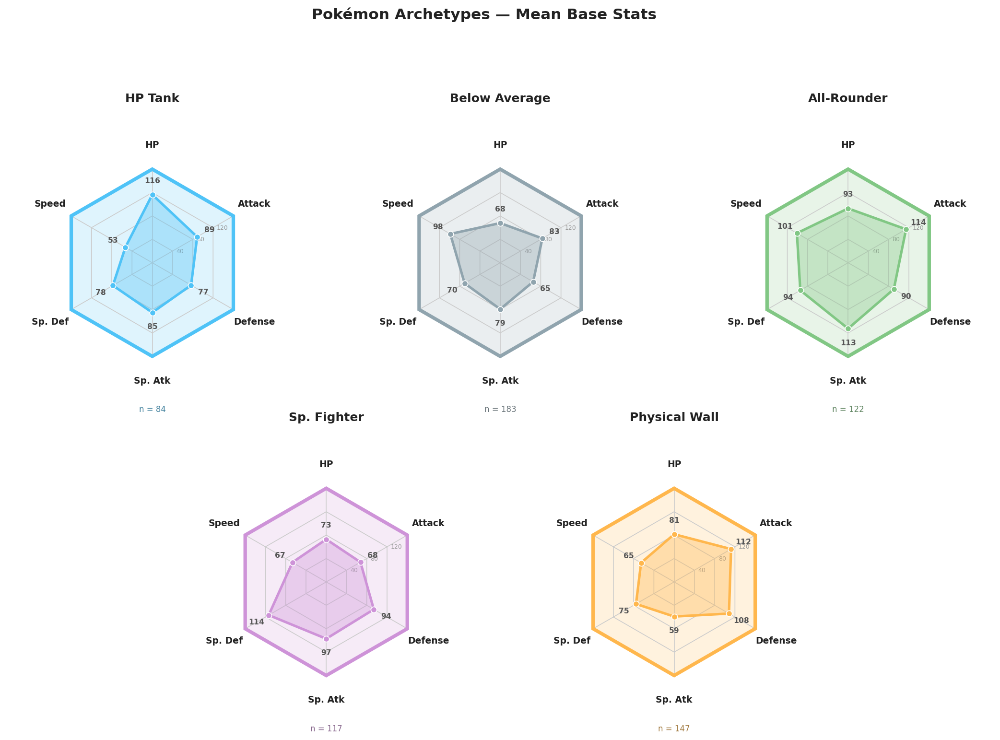
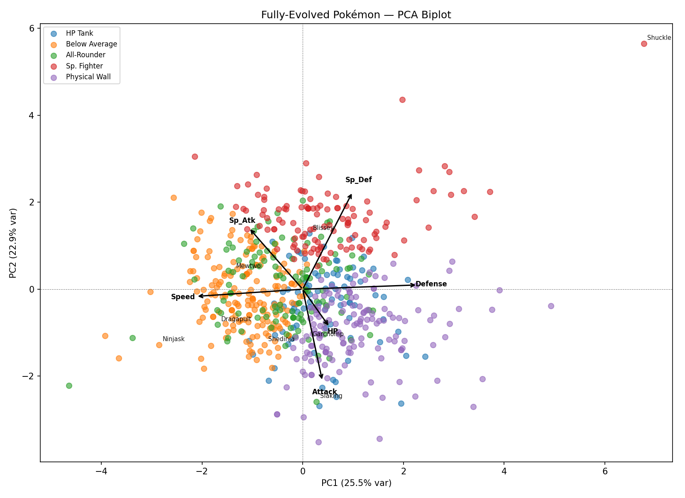
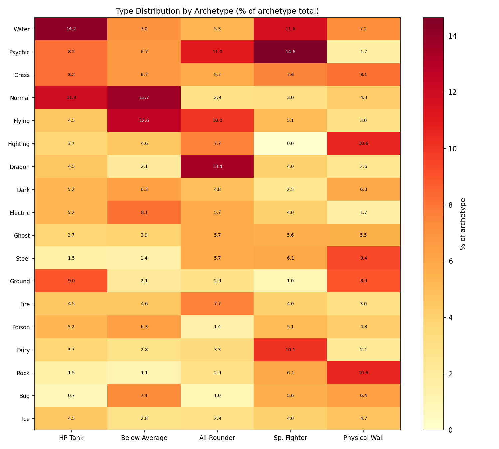
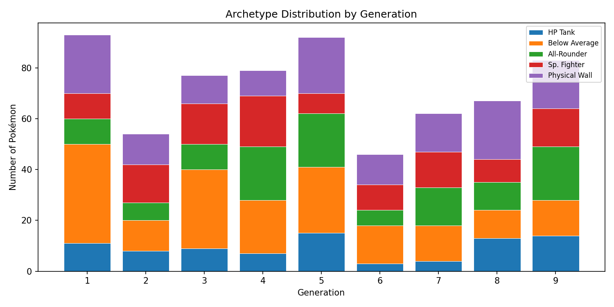

# Pokémon Archetype Classifier

Unsupervised and supervised machine learning pipeline that clusters all **653 fully-evolved Pokémon** into five archetypes based on their base stats, then trains classifiers to reproduce and explain those groupings.

---

## Pipeline

```
Data Collection → K-Means Clustering → KNN + Decision Tree → Visualisation
```

1. **Data collection** — scrapes PokémonDB and Bulbapedia, filters to fully-evolved Pokémon, and outputs a clean dataset with six base stats (HP, Attack, Defense, Sp. Atk, Sp. Def, Speed) across all nine generations.
2. **K-Means clustering** — standardised stats, K selected via elbow and silhouette analysis (K=5).
3. **Supervised learning** — 80/20 stratified train/test split on K-Means labels. KNN (94.7% held-out accuracy) for classification; Decision Tree (depth=3) for human-readable archetype rules.
4. **Visualisation** — PCA biplot, hexagonal radar charts per archetype, type heatmap, and generation breakdown.

---

## The Five Archetypes

| Archetype | n | Profile |
|---|---|---|
| HP Tank | 84 | High HP, low Speed — survives through raw bulk |
| Below Average | 183 | Uniformly low stats — the NFE-adjacent tier |
| All-Rounder | 122 | Solid across the board — the pseudo-legendary bracket |
| Sp. Fighter | 117 | Elevated Sp. Atk and Sp. Def — fights on the special side |
| Physical Wall | 147 | High Defense and Attack, low Speed — slow but immovable |

---

## Decision Rules (depth=3)

```
Defense ≤ 78
├── HP ≤ 84
│   ├── Sp. Def ≤ 96  →  Below Average
│   └── Sp. Def > 96  →  Sp. Fighter
└── HP > 84
    ├── Speed ≤ 86    →  HP Tank
    └── Speed > 86    →  All-Rounder
Defense > 78
├── Attack ≤ 84
│   ├── HP ≤ 97       →  Sp. Fighter
│   └── HP > 97       →  HP Tank
└── Attack > 84
    ├── Sp. Atk ≤ 94  →  Physical Wall
    └── Sp. Atk > 94  →  All-Rounder
```

---

## Results

| Model | Held-out Accuracy |
|---|---|
| KNN (k=9) | **94.7%** |
| Decision Tree (depth=3) | 71.0% |

---

## Visualisations

### Archetype Radar Charts


### PCA Biplot


### Type Distribution by Archetype


### Archetype Distribution by Generation


---

## How to Run

**1. Install dependencies**
```bash
pip install pandas requests lxml beautifulsoup4 scikit-learn matplotlib numpy
```

**2. Collect data** (or use the included `pokedex_fe.csv`)
```bash
python "Build Pokedex.py"
```

**3. Run the ML pipeline**
```bash
python pokemon_ml.py
```

Outputs: `radar_clusters_light.png`, `radar_clusters.png`, `pca_biplot.png`, `type_heatmap.png`, `generation_breakdown.png`, `pokedex_clustered.csv`

---

## Files

| File | Description |
|---|---|
| `Build Pokedex.py` | Scrapes and cleans the fully-evolved Pokédex |
| `pokemon_ml.py` | Full ML pipeline — clustering, classification, visualisation |
| `pokedex_fe.csv` | Cleaned input dataset (653 fully-evolved Pokémon) |
| `pokedex_clustered.csv` | Output dataset with cluster and archetype labels |
